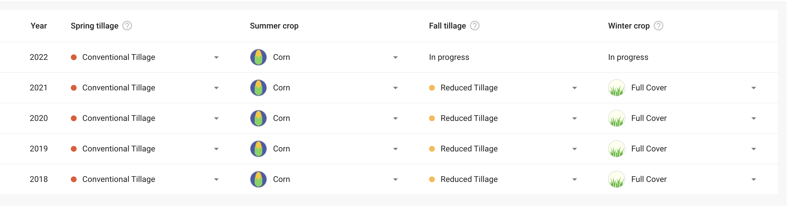

# Backend Interview Coding Challenge
This challenge is based on a simplified design challenge the Regrow engineering team has had to solve.

There is no expectation to get through all of this task, rather, we want to see how you think and how you approach problems. 

If you are completing this task live, please ask as many questions as you want. The more, the merrier!

If you have elected to do this as a take home, we are more interested in how you approached the problem, and the assumptions/decisions you made in your solution, rather than the efficiency or beauty of your code. Please feel free to contact Regrow (via your recruiter or our People team) for clarification on the task requirements. Alternatively you may wish to make an assumption and proceed. You are welcome to do this, we are evalulating problem solving and design rather than replicating a particular correct answer. However, in this case please document any assumptions you are making.

## Prologue, Setup
We have tested this using python 3.11.1. It may work on other versions, but for safety please use that revision.
Both a `pipfile` and `requirements.txt` are provided and contain all the packages you need. You can use more packages if you want.

In this zip file, we have created a boilerplate service. It has some methods as examples, that for basic usage, are correct. It should cover most of the methods required to complete this task.

All database tables are created in a file `database.db` via `sqlite`. Delete this file and restart the service to have it create your changed tables.

## The Problem: 
In one particular part of our system, we need to collect some information from farmers. Specifically, we need to ask them about what farming practices they have performed on their fields over the last several years.

For reference, the UI will render the table something like:

Typically, a table may look like this example:

| Year | Crop Type | Tillage Depth | Comments |
| --- | --- | --- | --- |
| Four digit number | Constrained Picklist (might be [corn, wheat, barley, hops...] | Constrained Float ie must be `0 <= x < 10`, can be optionally filled  | String |

However, due to the flexibility of our offering, this is not the only data we want to collect. We may want to collect something like:

| Year | Tilled? | External Account ID | Tillage Depth |
| --- | --- | --- | --- |
| Four digit number | Bool | Regex Validated String | Slider Control mapped to a float |

By the same token, we may want some other, unique set of columns that are picked from both the examples. You need to design and implement a solution that would let you represent both examples and any combination/permuation of their constituent columns.

Additionally, as per the screenshot, some configuration must be present to tell the UI how many years of data we wish to collect (hence how many rows to render).

In the future we may want to collect other information too; these columns are not fixed.

The UI will take your configuration and use it to render its data collection table. You don't need to save the actual values users enter, just the configuration for the table.

It is your task to:
- Define and implement a database schema that can store this configuration.
- Expose a REST API to create/delete these entities.
- Handle some validation of inputs where sensible.

Important notes:
- Please don't actually store any data; we are only interested in this task of how you would store the table schema. This is to specifically make the task shorter.

## Submission:

Please create a **private fork** of this repository.

We encourage you to edit the README, or create an additional file, to explain your solution. You may also add comments to the code explaining elements of your solution, these will be read.

*Let the Regrow team know, via your point of contact (either a recruiter or our internal people team), when you are ready for us to review.** At this point you will add us as collaborators on your repository so we can view your solution. Do not raise a pull-request against the original repository.

Good luck!
